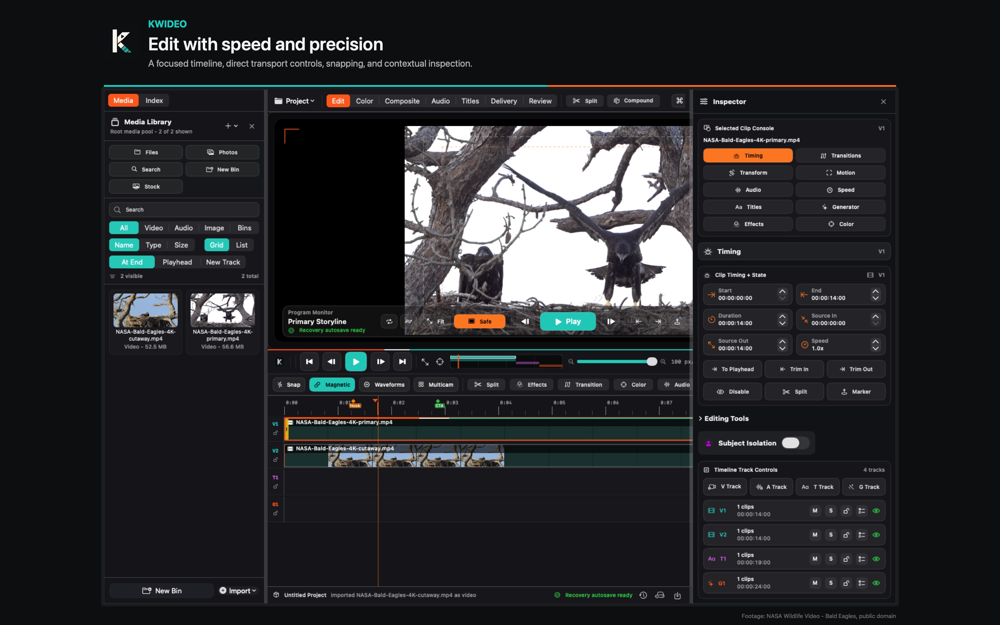
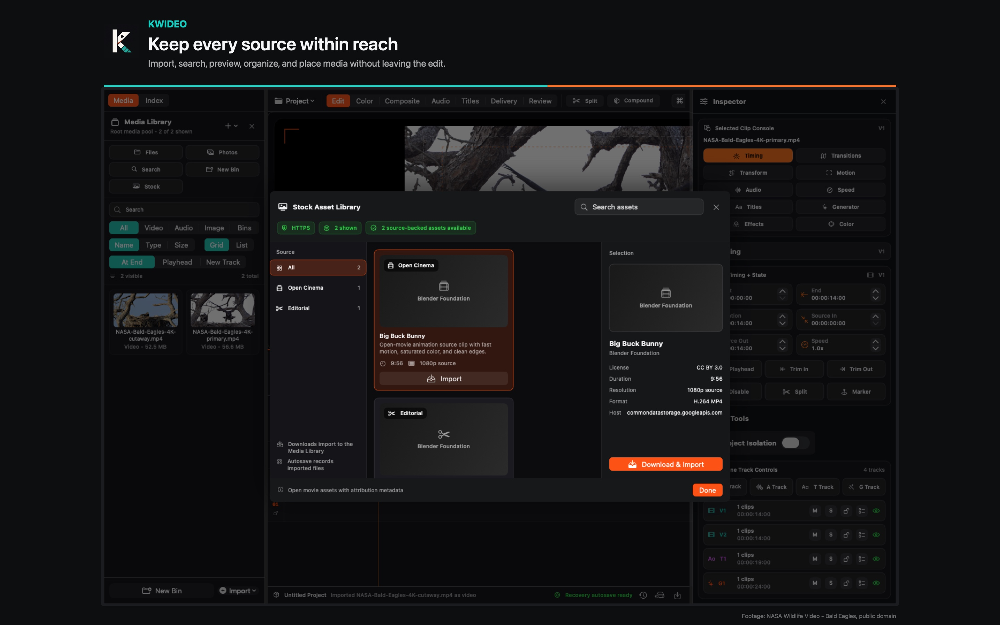
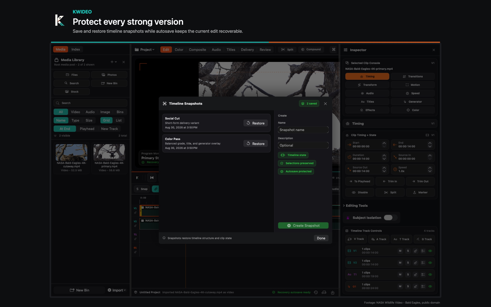
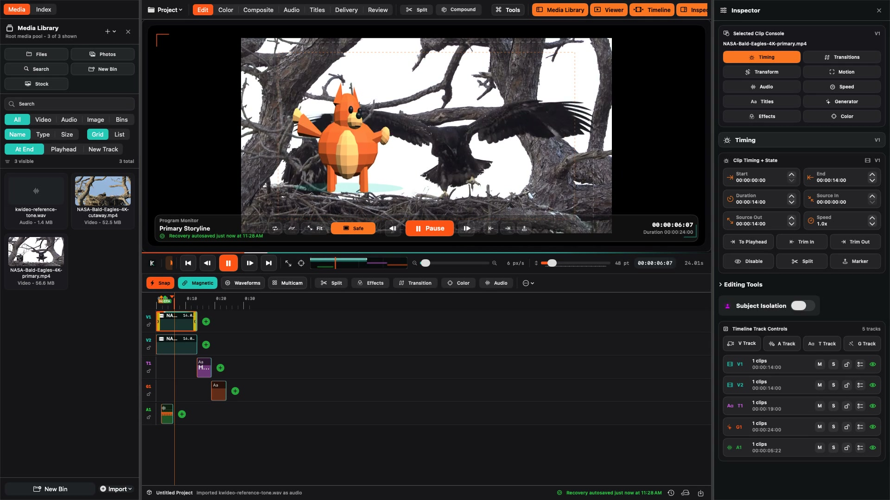
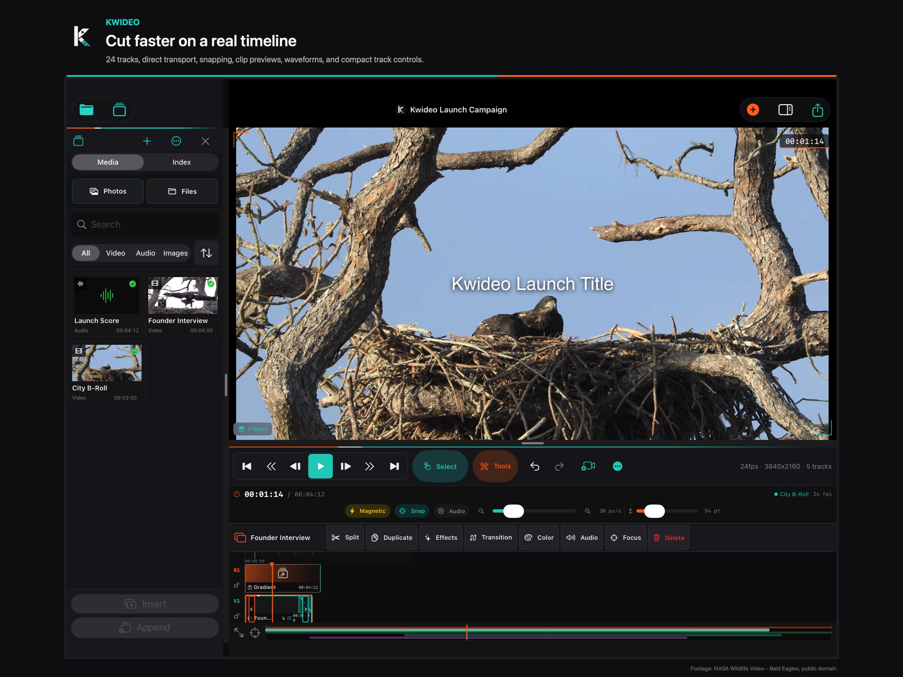
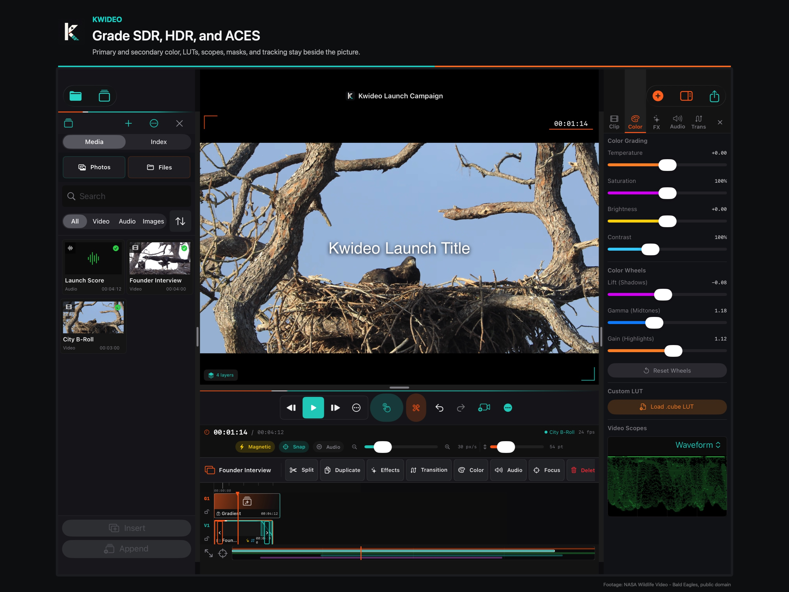
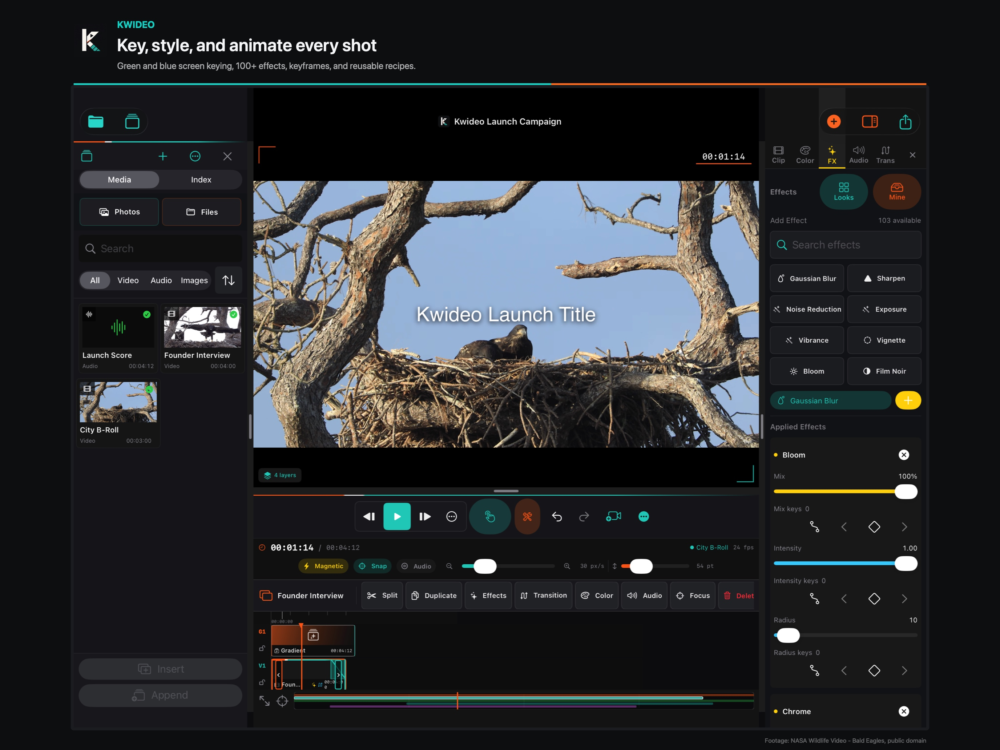
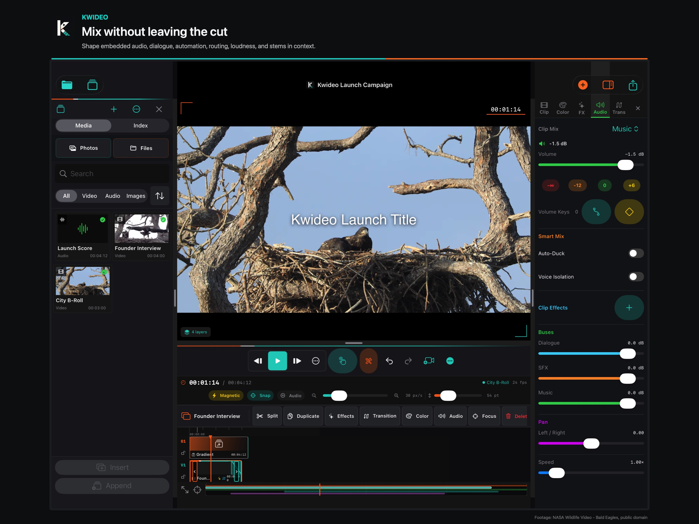
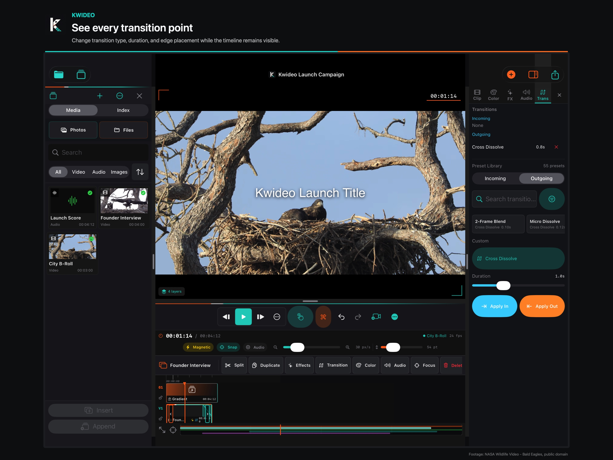
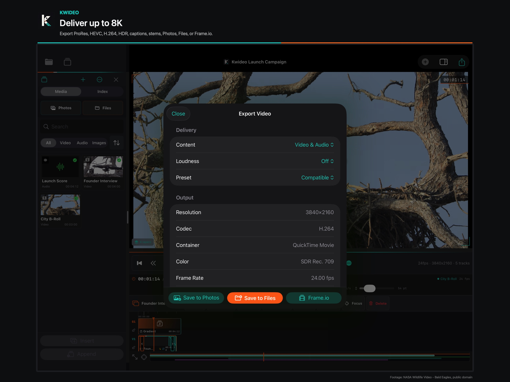

# Kwideo — Pro Video Editor

**Bring your footage. Kwideo brings the editing tools.**

> **Available now for Mac. Coming soon to iPad. One purchase covers both platforms.**

[**View Kwideo on the Mac App Store →**](https://apps.apple.com/us/app/kwideo-pro-video-editor/id6805311541?mt=12)

Kwideo is a feature-focused video editor for creators who already have footage and want serious editing capability without needing a bundled stock library, template marketplace, or content pack to justify the app.

This repository is a visual product and engineering showcase for Kwideo. It contains real captures from the shipping macOS application and the current iPad build so prospective users, reviewers, and collaborators can inspect the editor and its workflows while the proprietary application source remains private.

## What Kwideo demonstrates

The showcase covers real product workflows including:

- Timeline editing and project assembly
- Color grading and image adjustments
- Effects and compositing
- Audio tools and mix controls
- Transitions and motion work
- Asset browsing
- Delivery and export
- Project snapshots and recovery workflows
- Three.js overlay workflows on macOS

No mock UI is presented as product functionality. The screenshots and preview footage here are captures of Kwideo itself.

## Watch the product

- **macOS preview:** [Open the macOS product preview](media/macos/kwideo-macos-preview.mp4)
- **iPad preview:** [Open the current iPad product preview](media/ipad/kwideo-ipad-preview.mp4)

## macOS — available now

| Asset browser | Snapshots / recovery | Three.js overlay |
| --- | --- | --- |
|  |  |  |

The macOS showcase also includes soundtrack-generation and export-workflow captures in `media/macos/`.

[**Open Kwideo on the Mac App Store →**](https://apps.apple.com/us/app/kwideo-pro-video-editor/id6805311541?mt=12)

## iPad — coming soon

The iPad edition is currently in development and is planned as part of the same purchase as the Mac edition.

| Editor | Color | Effects |
| --- | --- | --- |
|  |  |  |

| Audio | Transitions | Export |
| --- | --- | --- |
|  |  |  |

## For reviewers and evaluators

For a quick evaluation, start with the macOS preview above and then inspect the workflow captures most relevant to you. A compact reviewer-oriented index is available in [`REVIEWER_GUIDE.md`](REVIEWER_GUIDE.md).

## Why this repository exists

Kwideo is commercial, closed-source software. The application source remains private, but prospective users and technical evaluators should still be able to inspect real evidence of what was built.

This repository therefore provides product evidence—real interface captures, workflows, and demonstrations—without publishing the proprietary application source.

## Source boundary

This repository intentionally contains **showcase media and documentation only**. It does not contain Kwideo application source code, Xcode projects, build artifacts, signing material, credentials, internal QA material, or private project files.

See `COPYRIGHT.md` for the proprietary-use notice.
